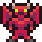
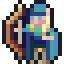

  <h1>ShadowDance 🎶</h1>

## Overview
The aim is simple : the player has to hit the corresponding musical notes that appear on screen
in different lanes on time to score points. To win each level, you need to beat a target score. The
second level features a special lane that has special notes such as bomb, speed up, slow down
and double score. The third level includes enemies who try to steal notes from the lanes and a
guardian who will shoot projectiles at these enemies when a key is pressed. 
You can choose which level to play from the start screen and also at the end of each level.
Can you beat the target scores and win the game?

## Level 1
The notes (,,,) will descend from the top vertically in the 4 lanes. You need to press the corresponding arrow key when the note overlaps 
with the stationary note symbol at the bottom. The accuracy of how close the note was to the stationary not when the key was pressed, 
will determine the points given. There will be hold notes (,,,) 
that require you to hold donw the key. To finish the level, you need to beat the target score of 150 when all the notes have fallen. If
the score is lower, the game ends.

  

## Level 2
Level 2 features the same game-play as Level 1 but you need to deal with additional features such as a special lane that has special notes:
- Double score note  will double all scores temporarily
- Speed up note  will increase the speed of all notes by 1
- Slow Down note  will decrease the speed of all notes by 1
- Bomb note  will remove all nots in that lane from the screen

Similar to normal note, if the corresponding key is pressed for the special note, its effect is applied. To win the level, you must beat a score of 400.

  

## Level 3
Level 3 is the final level. It includes all of the above as well as extra features such as enemies  and a
 guardian . An enemy moves horizontally and it will steal nots from nearby lanes by colliding with them. 
 The guardian will shoot projectiles at the nearest enemy when the corresponding key is pressed. To win the level, you must beat a score of 350.

  

  
     

  <strong>Good luck and have fun!</strong> ❤️

