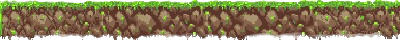
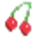
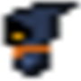

  <h1>ShadowMario️</h1>

## Level 1
You can control the player  to move left, right or jump by pressing the arrow keys. 
The player can collect coins  by colliding with them - collecting one coin, increases the score by one.
The enemies  can move in a fixed range. Starting with 100 health points, the player will lose 5 health points
if it collides with an enemy. To complete the level, the player needs to reach the end flag . If the player's health points
reduce to 0, the game ends.

  

## Level 2
Level 2 features the same gameplay as Level 1 but the player now has to deal with additional features.
Flying platforms  are moving entities that the player can jump on to and move on.
The player can gain some powers as well:
  - the invincible power  can make the player invincible to health loss from enemy collisions for a set period of time
  - the double score power  doubles the score from each coin collected for a set period of time.

  

## Level 3
Level 3 includes all of the above as well as an enemy boss  at the end of the level.
 When the enemy boss and the player come into a fixed distance from each other, they can both shoot fireballs  at
each other that cause 50 health points loss. Player can shoot the fireball by pressing 'S' key. To complete the level and finish the game, 
the player must beat the enemy boss and reach the end flag.

  

     

  
   
  <strong>Good luck and have fun!</strong> ❤️

