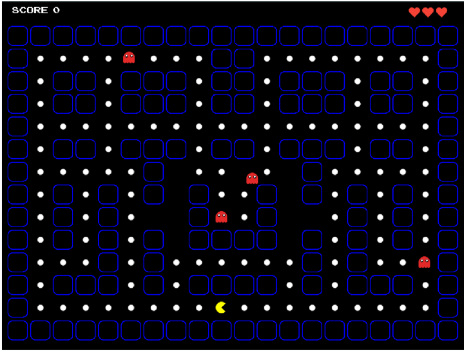
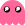

  <h1>ShadowPac</h1>

## Level 0
You can control the PacMan  through an enclosed maze. Starting with 3 lives, the PacMan will lose a life if it collides 
with a ghost. To win, move around the walls, eat all the dots in the maze and avoid red ghosts . If the 
PacMan loses all 3 lives, the game ends.

  

## Level 1
If you finishes level 0, the PacMan will enter Level 1. To win the level and the game, the PacMan must reach a score of 800. However, 
you need to deal with 4 types of ghosts in this level (red , blue , green 
, and pink . The ghosts will be moving in different directions. If the
PacMan collides with the pellet , the game goes into a frenzy mode, where the PacMan can gain extra points
when colliding with the ghosts and not lose any lives. You can also gain more points if colliding with a cherry .
Outside of the frenzy mode, the PacMan will lose a life if it collides with a ghost, and losing all 3 lives means the game will end.

  

     

  
   
  <strong>Good luck and have fun!</strong> ❤️

