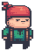
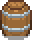
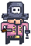
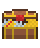
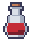
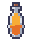
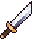
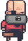
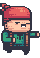

  <h1>ShadowPirate 🏴‍☠️</h1>

<i>
"The notorious pirate Blackbeard has stolen the Crown Jewels and is now hiding on the mysterious
Tortuga Island. You are a sailor in the Royal Navy’s crew that has been instructed by the King to
recover the jewels. Unfortunately your crew was ambushed, everyone has been captured and held
prisoner on Blackbeard’s ship, The Flying Dutchman near the island. Your mission, should you
be brave enough to accept it, is to escape the ship, fight the pirates on the island and recover the
jewels..."
</i>

## Level 0
You can control the sailor  to move around the blocks  on the 
deck of the ship using the arrow keys. Starting with 100% health points, the sailor will lose 10 health points if it enters a 
pirate's  attack range and is shooted by a projectile .
You can fight back to the pirate by pressing the 'S' key, which will cause 15 damage points to the pirate! To win the level, the 
sailor must reach the exit, located by the ladder (in the bottom right). If the sailor's health reduces to 0 or less, the game ends.

  

## Level 1
If you survive from the level 0, the sailor has escaped the ship (Congratulations!🎉) and arrived on Blackbeard's island. To win the 
level and the game, the sailor must get to the treasure . However, the sailor has to deal with bombs 
 which will explode and will cause 10 damage points if the sailor collides with them. Nevertheless, the sailor will encounter items on the
  island that can help him: 
  - the potion  can increase the sailor's current health points value by 25
  - the elixir  can increase the sailor's maximum health points value by 35 and increase the current health points to the new maximum value.
  - the sword  can increase the sailor's damage points value by 15

You will also of course need to deal with notorious pirate Blackbeard  who possess a damage value, a
maximum health points value, and an attack range twice that of a normal pirate 👿. The game will end if the sailor's health reduces to 0 or less.

  

     

  
   
  <strong>Good luck and have fun!</strong> ❤️

